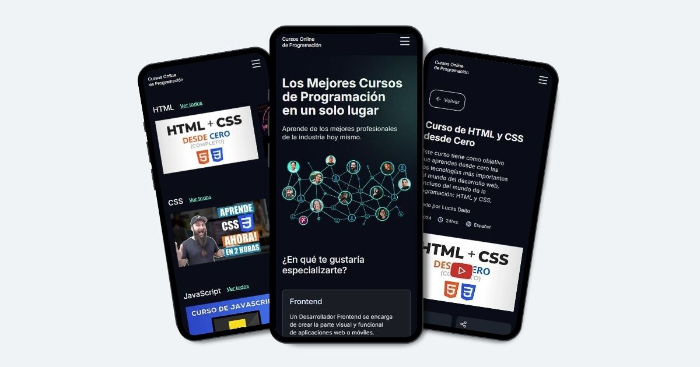

# Cursos Online de Programación

**Cursos Online de Programación** es un sitio web que reúne los mejores cursos online de programación, clasificados por Frontend, Backend y Aplicaciones Móviles.

## Vista previa

## Tecnologías utilizadas

- Next.js 14
- CSS Modules
- Swiper JS

## Explora el sitio web

Accede aquí → [Cursos Online de Programación](https://cursosonlinedeprogramacion.vercel.app/)

## Desarrollado por

**Luciano Treachi**

Soy un Desarrollador Frontend dedicado a crear soluciones web eficientes, accesibles, intuitivas y fáciles de usar que potencian la experiencia del usuario.

